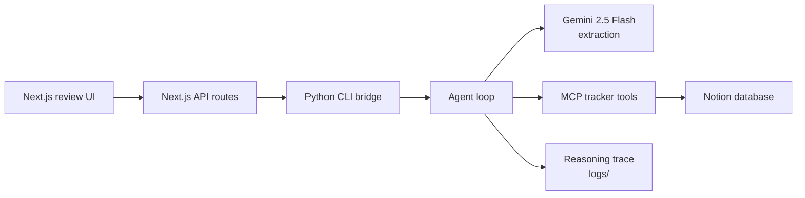
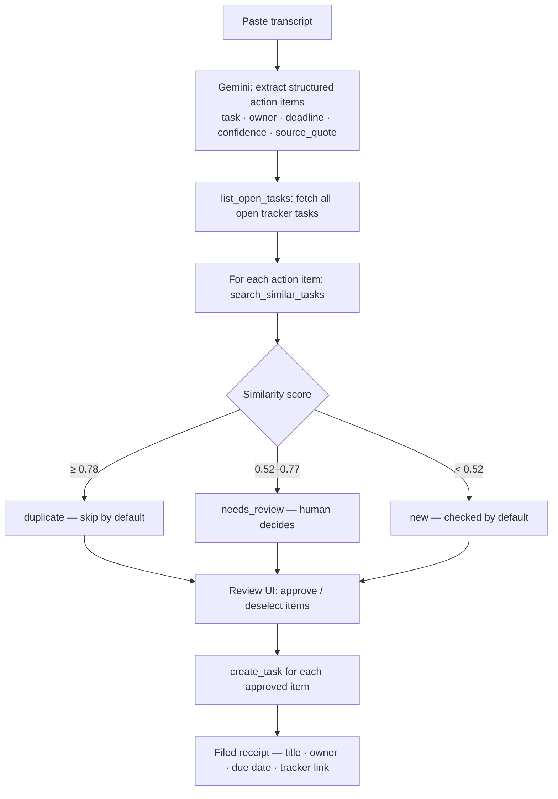

# Docket MCP

> Turn meeting transcripts into reviewed, tracker-ready action items — with a human sign-off before anything touches your database.

Docket is a human-in-the-loop agent that reads a meeting transcript, extracts structured action items using Gemini 2.5 Flash, checks each one against your Notion tracker for likely duplicates, presents everything for review, and only creates tasks after you approve them. The tracker integration is exposed as an **MCP server** — a clean, tool-bounded interface that any MCP-compatible agent or host can use independently.

---

## Table of Contents

- [What is MCP?](#what-is-mcp)
- [How Docket Uses MCP](#how-docket-uses-mcp)
- [Architecture](#architecture)
- [Quick Start](#quick-start)
- [Environment Variables](#environment-variables)
- [Using the App](#using-the-app)
- [MCP Server — Tool Reference](#mcp-server--tool-reference)
- [MCP Server — Usage Examples](#mcp-server--usage-examples)
- [Notion Database Setup](#notion-database-setup)
- [CLI & Agent Commands](#cli--agent-commands)
- [Sample Transcripts](#sample-transcripts)
- [Reasoning Trace Example](#reasoning-trace-example)
- [Design Decisions](#design-decisions)

---

## What is MCP?

The **Model Context Protocol (MCP)** is an open standard that lets AI agents call external tools through a clean, typed interface — without the agent needing to know the implementation details of those tools. Think of it as a USB-C standard for AI tool integrations: any MCP-compatible host (Claude Desktop, Claude Code, any agent framework) can connect to any MCP server and immediately use its tools.

Without MCP:
- Each agent re-implements Notion/Linear/Jira API access from scratch.
- Tool logic is tangled into prompts and hard to test or reuse.

With MCP:
- The tracker logic lives in one server (`backend/tracker_server.py`).
- The agent — or any host — calls `list_open_tasks()`, `search_similar_tasks()`, `create_task()` as typed function calls.
- You can swap the tracker backend (Notion → Linear → Jira) without touching the agent logic.

---

## How Docket Uses MCP

The MCP tracker server (`backend/tracker_server.py`) exposes three tools:

| Tool | Signature | What it does |
|---|---|---|
| `list_open_tasks` | `() → list[Task]` | Returns all open/incomplete tasks from Notion |
| `search_similar_tasks` | `(query: str) → list[Task]` | Fuzzy-matches `query` against open task titles; returns up to 5 ranked by similarity |
| `create_task` | `(title, owner?, due_date?, source_meeting?) → Task` | Creates a new task in Notion, resolving relative dates ("Friday" → ISO date) |

The agent in `backend/agent.py` calls these tools directly as Python functions. Because the server is also a proper `FastMCP` server, the same tools are available to any MCP host that registers the server — see [MCP Server — Usage Examples](#mcp-server--usage-examples).

---

## Architecture

**Component flow:**



**Agent step by step:**



**Duplicate detection** uses a token-overlap + sequence-ratio similarity score with a domain stopword list (`review`, `update`, `fix`, `add`, `create`, etc.) so generic action verbs don't trigger false positives between unrelated tasks.

---

## Quick Start

**Prerequisites:** Node.js 18+, Python 3.11+

```bash
# 1. Clone and install Node dependencies
git clone https://github.com/your-username/Docket-MCP.git
cd Docket-MCP
npm install

# 2. Create and activate a Python virtual environment
python3 -m venv .venv
source .venv/bin/activate   # Windows: .venv\Scripts\activate

# 3. Install Python dependencies
pip install -r requirements.txt

# 4. Configure environment variables
cp .env.example .env.local
# Edit .env.local — add your Gemini API key and Notion credentials

# 5. Start the dev server
npm run dev
```

Open [http://localhost:3000](http://localhost:3000).

> **Demo mode (no API keys needed):** The app works without any keys. It falls back to a rule-based heuristic extractor and a mock Notion tracker so you can explore the full UI flow immediately.

---

## Environment Variables

Configure in `.env.local` (never committed — it is in `.gitignore`):

| Variable | Required | Description |
|---|---|---|
| `GEMINI_API_KEY` | Recommended | Gemini 2.5 Flash API key. Without it, the heuristic fallback extractor is used. |
| `GEMINI_MODEL` | No | Defaults to `gemini-2.5-flash`. Override to use another Gemini model. |
| `NOTION_API_KEY` | For real tasks | Your Notion internal integration secret (`ntn_...`). |
| `NOTION_DATABASE_ID` | For real tasks | 32-character ID from the Notion database URL. |
| `NOTION_TITLE_PROPERTY` | No | Defaults to `Name`. The name of the title column in your Notion database. |
| `NOTION_OWNER_PROPERTY` | No | Defaults to `Owner`. The assignee/owner text column. |
| `NOTION_DUE_DATE_PROPERTY` | No | Defaults to `Due Date`. Must be a Notion **Date** property. |
| `NOTION_STATUS_PROPERTY` | No | Defaults to `Status`. Used to filter out completed tasks. |
| `NOTION_STATUS_DONE_VALUES` | No | Comma-separated list of "done" status values to exclude. Defaults to `Done,Complete,Completed,Archived`. |
| `NOTION_SOURCE_PROPERTY` | No | Defaults to `Source Meeting`. Text property tagging where the task came from. |
| `PYTHON_BIN` | No | Python executable used by the Next.js API routes. Defaults to `python3`. Set this to `.venv/bin/python` if your virtual env Python isn't the system default. |

---

## Using the App

### 1. Paste a transcript

Paste any meeting transcript — a Zoom/Meet export, a copy of your notes, or even a rough summary. Include the speaker names followed by a colon:

```
Priya: Het, can you review duplicate detection thresholds before Friday?
Het: Yes, I'll tighten the scoring and add test examples.
Maya: I'll draft the onboarding copy by tomorrow.
Arjun: Someone should look into exporting the reasoning trace for the demo.
```

### 2. Process

Click **Process**. The agent runs the full extraction + duplicate-check loop and returns a docket of reviewed entries. Each entry shows:

- **Decision badge** — `new`, `duplicate`, or `needs review`
- **Owner + Due date** — extracted from the transcript
- **Confidence** — how explicit the assignment was (< 60% triggers `needs review`)
- **Reasoning** — a plain-English explanation of the duplicate decision
- **Verbatim quote** — the exact transcript line the task came from
- **Cross-reference** — the closest existing tracker task (if any)

### 3. Review and approve

Items marked `new` are checked by default. Items marked `duplicate` are unchecked. Adjust as needed, then click **Create Approved Tasks**.

### 4. Receipt

After creation you see a filed receipt:

```
✓ 3 tasks filed to tracker
─────────────────────────────
✓  Tighten duplicate-detection scoring thresholds
   Owner: Het  ·  Due: 2026-07-04
   Open in tracker ↗

✓  Draft onboarding copy
   Owner: Maya  ·  Due: 2026-07-02

✓  Export reasoning trace for demo
   Owner: —
```

---

## MCP Server — Tool Reference

The server (`backend/tracker_server.py`) runs as a `FastMCP` server and can be registered with any MCP host.

---

### `list_open_tasks()`

Returns all incomplete tasks from the Notion database, excluding any whose `Status` matches your `NOTION_STATUS_DONE_VALUES`.

**Returns:** `list[Task]`

```python
[
  {
    "id": "abc123...",
    "title": "Review duplicate detection thresholds",
    "owner": "Het",
    "due_date": "2026-07-04",
    "status": "In Progress",
    "url": "https://www.notion.so/..."
  },
  ...
]
```

---

### `search_similar_tasks(query: str)`

Finds open tasks with titles similar to `query`. Uses a token-overlap + sequence-ratio hybrid score with domain stopwords filtered out. Returns up to 5 results ranked by score, filtered to similarity ≥ 0.28.

**Parameters:**
- `query` — the task description to search for

**Returns:** `list[Task]` with an added `similarity` field (0–1)

```python
search_similar_tasks("tighten scoring thresholds for duplicate detection")
# →
[
  {
    "id": "abc123...",
    "title": "Review duplicate detection thresholds",
    "owner": "Het",
    "due_date": null,
    "status": "Todo",
    "url": "https://www.notion.so/...",
    "similarity": 0.714
  }
]
```

---

### `create_task(title, owner=None, due_date=None, source_meeting=None)`

Creates a new task in Notion. Automatically resolves relative date strings to ISO-8601 dates before writing, so the Notion `Due Date` property is always set correctly.

**Parameters:**
- `title` — task description (required)
- `owner` — assignee name (optional; written as text, not a Notion person lookup)
- `due_date` — deadline string. Accepts ISO dates (`2026-07-04`) and relative expressions: `today`, `tomorrow`, `EOD`, `end of week`, `Monday`…`Sunday`
- `source_meeting` — meeting reference tag (optional; written to the `Source Meeting` property)

**Returns:** the created `Task` object

```python
create_task(
    title="Tighten duplicate-detection scoring thresholds",
    owner="Het",
    due_date="Friday",           # → resolved to "2026-07-04" automatically
    source_meeting="Weekly standup 2026-07-01"
)
# →
{
  "id": "new-page-id...",
  "title": "Tighten duplicate-detection scoring thresholds",
  "owner": "Het",
  "due_date": "2026-07-04",
  "status": "Todo",
  "url": "https://www.notion.so/..."
}
```

If `due_date` cannot be resolved to an ISO date (e.g. a free-text phrase like "sometime next sprint"), it is appended to the task title as `(Due: sometime next sprint)` so the information is never silently dropped.

---

## MCP Server — Usage Examples

The MCP tracker server can be used in three ways beyond the Docket UI.

---

### 1. Register with Claude Desktop

Add to your `claude_desktop_config.json` (`~/Library/Application Support/Claude/claude_desktop_config.json` on macOS):

```json
{
  "mcpServers": {
    "docket-tracker": {
      "command": "~/Docket-MCP/.venv/bin/python",
      "args": ["~/Docket-MCP/backend/tracker_server.py"],
      "env": {
        "NOTION_API_KEY": "your_notion_integration_secret_here",
        "NOTION_DATABASE_ID": "your_notion_database_id_here"
      }
    }
  }
}
```

Restart Claude Desktop. You can now ask Claude things like:

> "What are my open tasks?"
> "Is there already a task about onboarding copy?"
> "Create a task for Het to review the API rate limits by Thursday."

---

### 2. Register with Claude Code (CLI)

Add the server to your Claude Code MCP config:

```bash
claude mcp add docket-tracker \
  ~/Docket-MCP/.venv/bin/python \
  ~/Docket-MCP/backend/tracker_server.py \
  --env NOTION_API_KEY=your_notion_integration_secret_here \
  --env NOTION_DATABASE_ID=your_notion_database_id_here
```

Then in any Claude Code session:

```
/mcp docket-tracker list_open_tasks
```

Or just describe what you want and Claude Code will call the tool automatically:

> "Check if we already have a task for the login page redesign, and if not, create one assigned to Maya due next Friday."

---

### 3. Use from Python directly

The tools are plain Python functions. Import and call them without the MCP layer for scripts, notebooks, or other agents:

```python
import os
os.environ["NOTION_API_KEY"] = "your_key"
os.environ["NOTION_DATABASE_ID"] = "your_db_id"

from backend.tracker_server import list_open_tasks, search_similar_tasks, create_task

# Check what's open
tasks = list_open_tasks()
for task in tasks:
    print(f"{task['title']} — {task['owner']} — {task['due_date']}")

# Before creating, check for duplicates
candidates = search_similar_tasks("deploy the staging environment")
if candidates and candidates[0]["similarity"] > 0.78:
    print(f"Already exists: {candidates[0]['title']}")
else:
    created = create_task(
        title="Deploy the staging environment",
        owner="Arjun",
        due_date="end of week",
        source_meeting="Deployment planning call"
    )
    print(f"Created: {created['url']}")
```

---

### 4. Use via FastMCP CLI (development / testing)

```bash
# Run the server in dev mode (streams tool calls to stdout)
source .venv/bin/activate
NOTION_API_KEY=... NOTION_DATABASE_ID=... \
  fastmcp dev backend/tracker_server.py
```

---

## Notion Database Setup

1. Go to [notion.so](https://www.notion.so) and create a new **database** (not a page).
2. Add the following properties (the names must match your `.env.local` values exactly — defaults shown):

   | Property | Type | Default name |
   |---|---|---|
   | Title | Title | `Name` |
   | Owner/Assignee | Text | `Owner` |
   | Deadline | **Date** | `Due Date` |
   | Progress | Status | `Status` |
   | Meeting source | Text | `Source Meeting` |

3. Create a Notion internal integration at [notion.so/my-integrations](https://www.notion.so/my-integrations). Copy the `ntn_...` secret into `NOTION_API_KEY`.
4. Open your database → click `...` (top-right) → **Connections** → add your integration. This is required — Notion won't accept API calls to a database the integration isn't connected to.
5. Copy the database ID from the URL:
   `https://notion.so/yourworkspace/`**`abc123def456...`**`?v=...`
   Paste it into `NOTION_DATABASE_ID`.

---

## CLI & Agent Commands

```bash
# Run the Next.js frontend
npm run dev

# Run the full agent loop on a transcript file
npm run agent:demo
# equivalent to: python3 backend/agent.py samples/standup.txt

# Run the Gemini extraction test
npm run extract:test

# Smoke-test the tracker tools (list, search, create in mock mode)
npm run tracker:test

# Lint and build
npm run lint
npm run build
```

**Direct CLI usage** (mirrors what the Next.js API routes call internally):

```bash
# Process a transcript → extraction + duplicate check → review JSON
echo '{"transcript": "Het: I will fix the login bug by EOD.", "source_meeting": "Bug triage"}' \
  | .venv/bin/python backend/cli.py process | python3 -m json.tool

# Create approved tasks from a review payload
echo '{
  "items": [
    {
      "action_item": {"task": "Fix the login bug", "owner": "Het", "deadline": "EOD"},
      "decision": "new",
      "reasoning": "No similar open tasks.",
      "similar_tasks": []
    }
  ],
  "source_meeting": "Bug triage"
}' | .venv/bin/python backend/cli.py create
```

Reasoning traces are written automatically to `logs/agent_trace_<timestamp>.json` on every `process` run.

---

## Sample Transcripts

Three sample transcripts are included in `samples/`:

| File | What it tests |
|---|---|
| `standup.txt` | Mix of explicit assignments, direct requests, and a vague "someone should" item |
| `group_project.txt` | Multiple speakers, EOD deadline, ambiguous items |
| `zero_actions.txt` | No action items — tests the empty-state handling (no hallucinated tasks) |

Run against any of them:

```bash
.venv/bin/python backend/agent.py samples/group_project.txt | python3 -m json.tool
```

---

## Reasoning Trace Example

Every `process` call writes a full trace to `logs/`. Here is the duplicate-check step for a task that exactly matches an existing open task:

**Transcript line:**
```
Priya: Het, can you review duplicate detection thresholds before Friday?
```

**Extracted action item:**
```json
{
  "task": "Review duplicate detection thresholds",
  "owner": "Het",
  "deadline": "2026-07-04",
  "confidence": 0.91,
  "source_quote": "Priya: Het, can you review duplicate detection thresholds before Friday?"
}
```

**Duplicate check:**
```json
{
  "step": "duplicate_check",
  "similar_tasks": [
    {
      "title": "Review duplicate detection thresholds",
      "owner": "Het",
      "status": "Todo",
      "similarity": 1.0
    }
  ],
  "decision": "duplicate",
  "reasoning": "Closest open task is 'Review duplicate detection thresholds' with similarity 1.00, likely the same work."
}
```

The item appears in the review UI with a `duplicate` stamp and is unchecked by default — no duplicate task is created unless you manually re-check it.

---

## Design Decisions

**Human in the loop, always.** Nothing is written to the tracker without a checkbox review. This is both a safety practice and a more honest engineering story for a v1: the agent assists, the human decides.

**MCP as a tool boundary.** The tracker tools are self-contained and testable independently of the extraction or agent logic. Swapping Notion for Linear means rewriting one file (`tracker_server.py`) without touching the agent, the UI, or the extraction pipeline.

**Relative date resolution at the tracker layer.** Deadlines like "Friday" or "EOD" are resolved to ISO-8601 dates inside `create_task()`, not during extraction. This means the resolution is correct regardless of whether Gemini or the heuristic extractor produced the deadline string, and it happens immediately before the Notion write — no date can be silently dropped.

**Stopword-filtered similarity for duplicate detection.** Generic action verbs (`review`, `update`, `fix`, `add`, `create`) are treated as stopwords in the similarity score. Two tasks that share only a common verb but operate on completely different subjects (e.g. "Update the onboarding copy" vs "Update the API rate-limit logic") score near zero and are correctly classified as distinct work.

